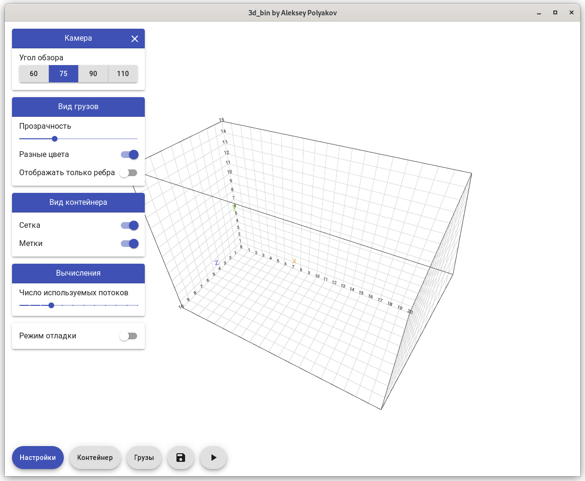
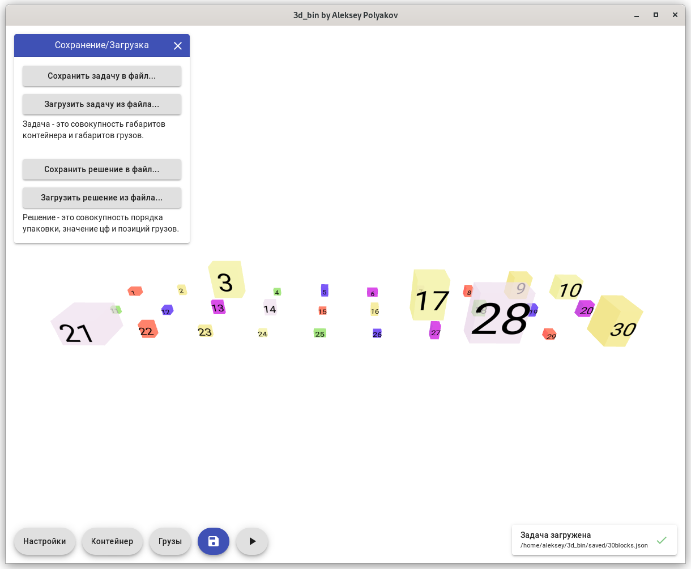
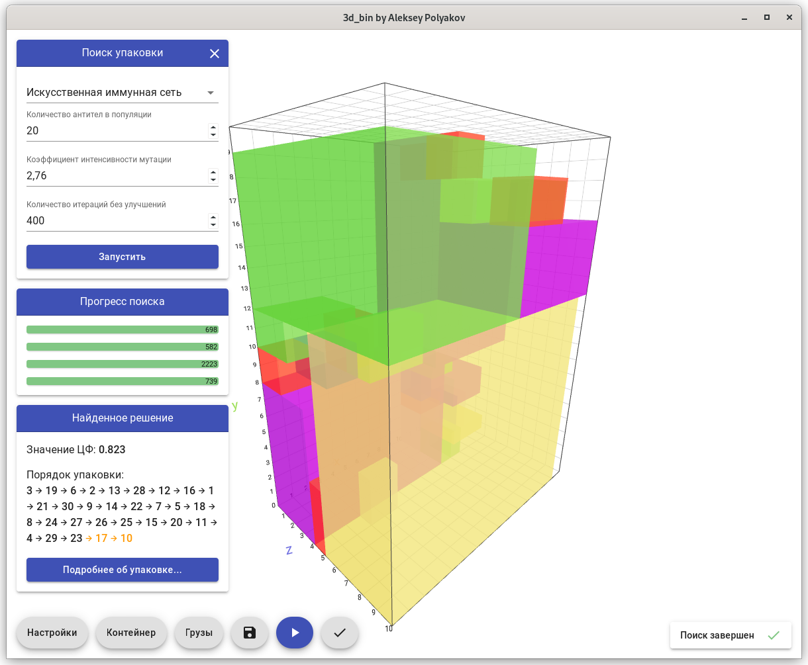
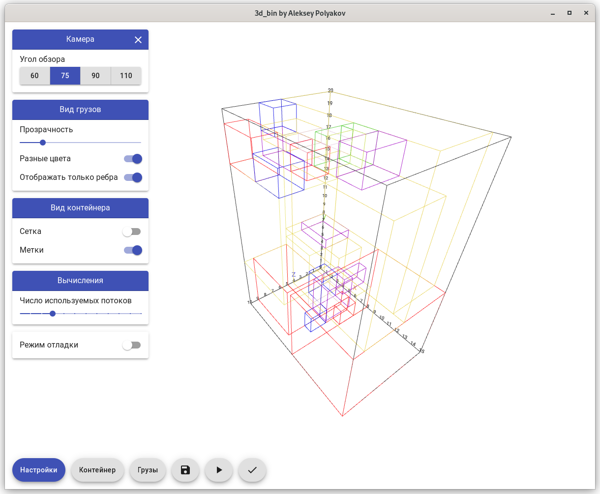
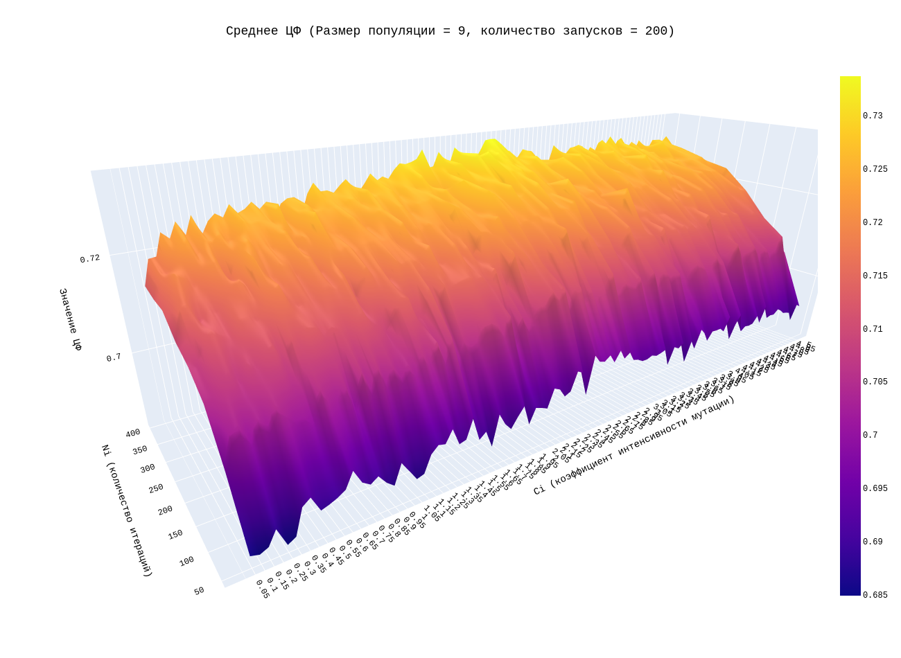
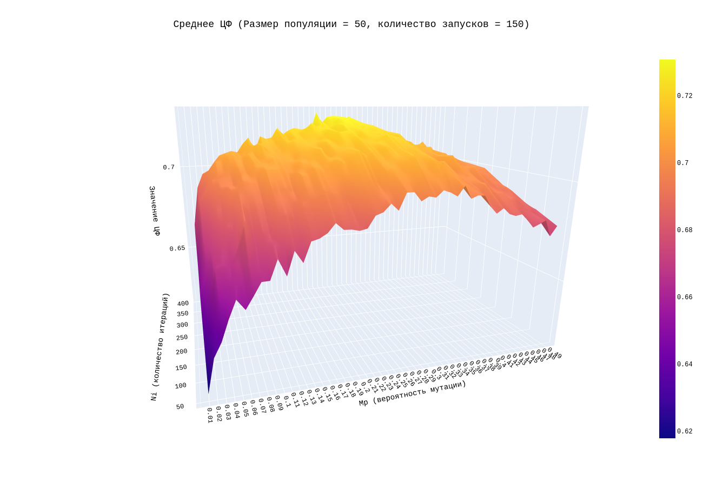
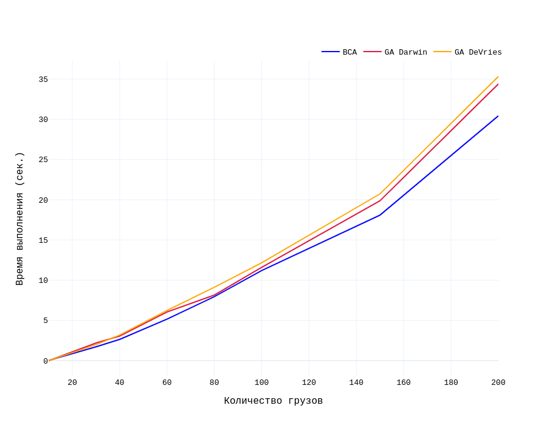
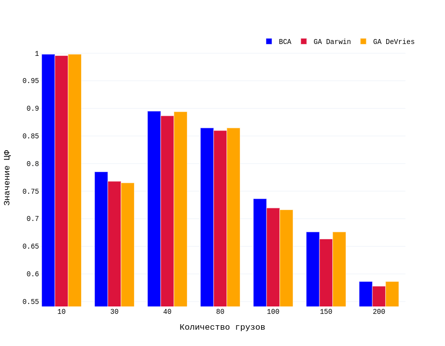

## 3D Bin Packing
This is a GUI 3D bin packing problem solver written in go and typescript using:
1) [wails](https://github.com/wailsapp/wails) - a gui framework that makes it possible to write desktop applications using Go and web technologies
2) [vite](https://github.com/vitejs/vite) - next generation frontend tooling
3) [react](https://github.com/facebook/react) - a declarative js library for building gui
4) [mui (material-ui)](https://github.com/mui) - a react components library
5) [zustand](https://github.com/pmndrs/zustand) - a minimalistic state management library
6) [three.js](https://github.com/mrdoob/three.js/) - a general purpose 3D library
7) [react-three/fiber](https://github.com/pmndrs/react-three-fiber) - a react renderer for three.js

The following algorithms are available to use:
1) A custom implementation of B-Cell Algorithm
2) Genetic algorithms based on different evolution models: Darwin and de Vries  

|                               |                               |    
|:-----------------------------:|:------------------------------|
|  |  |
|  |  |

### How to build
#### Prerequisites
* go 1.18
* node 15+
* [wails v2 beta36+](https://github.com/wailsapp/wails): `go install github.com/wailsapp/wails/v2/cmd/wails@latest`
* you might need to install some additional packages/dependencies:
   * Fedora 36 requires webkit2gtk3-devel package to successfully build the application:  
      `sudo dnf install -y webkit2gtk3-devel`
   * Check [official wails v2 installation guide](https://wails.io/docs/gettingstarted/installation/) if you use other Linux distro | MacOS | Windows
#### Build command 
`wails generate module && wails build`  

### Development
`wails generate` to generate wailsjs runtime and go/ts bindings  
`wails dev` to run the app in development mode (with hot reload)  
`wails dev -browser` to run the app in development mode in a browser

### Research 

#### Optimal parameters

The research of both algorithms was done on a [randomly generated task of size 47](./saved/47blocks.json) (1 container and 47 blocks)

**For this task the best solution is 0.773552** (there is no solution where the container is fully filled)

|                           BCA                           |               
GA 
                |    
|:-------------------------------------------------------:|:------------------------------------------------------:|
|  |  |

#### Comparison

Comparison of speed and efficiency was also done out using randomly generated tasks of different sizes  
_(except for the first task of size 10, which has 1.0 solution)_

|                          Speed                          |                          Efficiency                           |    
|:-------------------------------------------------------:|:-------------------------------------------------------------:|
|  |   |

### Demo
https://user-images.githubusercontent.com/58259700/180448623-d1d14059-a22b-482a-98ec-4bf44358c297.mp4

